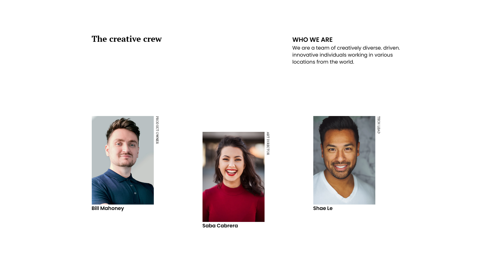

<!-- Please update value in the {}  -->

<h1 align="center">My Team Page</h1>

   Projeto realizado para o desafio do site <a href="http://devchallenges.io" target="_blank">Devchallenges.io</a>.

  <h3>
    <a href="https://github.com/souza-vitor/My-Team-Page">
      Demo
    </a>
     | 
    <a href="https://devchallenges.io/challenges/hhmesazsqgKXrTkYkt0U">
      Desafio
    </a>
  </h3>

<!-- TABLE OF CONTENTS -->

## Table of Contents

- [Overview](#overview)
  - [Tecnologias](#built-with)
- [Features](#features)
- [Contato](#contact)

<!-- OVERVIEW -->

## Overview

Este projeto foi construido com o objetivo de praticar o uso de HTML e CSS. O site foi construido seguindo o layout do Figma. Tive a oportunidade de praticar o Flexbox.

### Tecnologias 

<!-- This section should list any major frameworks that you built your project using. Here are a few examples.-->

- [HTML](https://developer.mozilla.org/pt-BR/docs/Web/HTML)
- [CSS](https://developer.mozilla.org/pt-BR/docs/Web/CSS)

## Features

<!-- List the features of your application or follow the template. Don't share the figma file here :) -->

Este site foi construido como uma solução para o desafio no [DevChallenges](https://devchallenges.io/challenges). O [Desafio](https://devchallenges.io/challenges/hhmesazsqgKXrTkYkt0U) era construir o website seguindo as user stories.

## Contato

- Website [your-website.com](https://{your-web-site-link})
- GitHub [@souza-vitor](https://github.com/souza-vitor)
